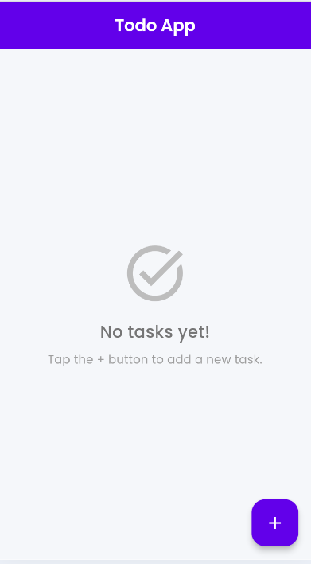
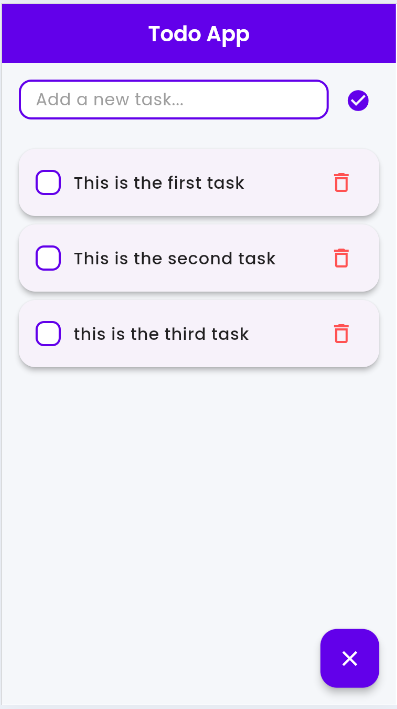
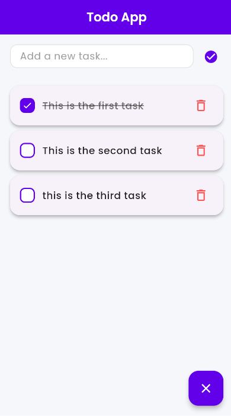

# Flutter Todo App

A beautiful and intuitive Flutter todo application with a modern UI design.

## Features

- Clean and modern user interface
- Add new tasks easily
- Mark tasks as completed
- Delete tasks
- Responsive design
- Beautiful purple theme with Google Fonts

## Screenshots

### Empty Homepage
The clean starting state when no tasks have been added yet.

### Tasks Added
Multiple tasks added to the todo list with an intuitive interface.

### Task Completed
First task marked as completed with visual feedback (strikethrough text).

## Getting Started

This project is built with Flutter. To run this application:

1. Make sure you have Flutter installed on your system
2. Clone this repository
3. Run `flutter pub get` to install dependencies
4. Run `flutter run` to start the application

## Dependencies

- `flutter/material.dart` - Core Flutter UI framework
- `google_fonts` - Beautiful typography with Google Fonts

## Project Structure

lib/
├── main.dart           # App entry point and theme configuration
├── models/            # Data models
├── screens/           # UI screens
└── services/          # Business logic and services

For help getting started with Flutter development, view the
[online documentation](https://docs.flutter.dev/), which offers tutorials,
samples, guidance on mobile development, and a full API reference.
